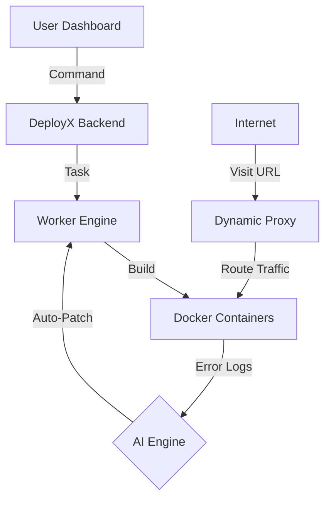

#  DeployX: The Intelligent Cloud Engine

  

  
  
  

---

## 🌟 What is DeployX?
DeployX is an **All-in-One Deployment Platform** designed to take your code from GitHub to a live URL in seconds. No more manual server setup, no more Nginx configuration, and no more build crashes. 

**Our secret sauce?** An AI-driven "Self-Healing" brain that fixes your code errors automatically during the build process.

---

## 🛤️ The 1-2-3 Workflow (How it Works)

DeployX simplifies the complex world of DevOps into 3 simple stages:

### 1️⃣ Connect & Scan 🔍
- **Import**: Link your GitHub repository.
- **AI Analysis**: Our AI engine scans your files to understand if you're deploying a **Frontend** (React/Next) or **Backend** (Node/Express).
- **Environment**: Add your API keys and Secrets directly in our clean UI.

### 2️⃣ Build & Heal 🛠️
- **Automatic Dockerization**: DeployX creates a custom "Container" for your app.
- **Self-Healing**: If a build fails (e.g., a missing package), our **AI Agent** reads the error logs, writes a code fix, and restarts the build. You don't have to lift a finger!

### 3️⃣ Go Live 🚀
- **Instant URL**: Your app is assigned a unique subdomain (e.g. `myapp.deployx.io`).
- **Smart Routing**: Our custom Proxy automatically directs internet traffic to your specific container.

---

## 🏗️ Under the Hood (Architecture)

We’ve built a robust distributed system to ensure your apps are always online:

- **The Brain (AI Engine)**: Uses Google Gemini 2.0 to solve DevOps puzzles.
- **The Muscle (Docker)**: Keeps every app isolated and secure.
- **The Router (Proxy)**: Acts as the traffic police for your live links.

---

## 🆚 Why DeployX is Better

| Feature | The Old Manual Way | The DeployX Way |
| :--- | :--- | :--- |
| **Setup Time** | Hours (SSH, Nginx, Linux setup) | **30 Seconds** |
| **Error Handling** | Manual debugging for hours | **AI Auto-Fixes in real-time** |
| **SSL & URLs** | Hard to configure | **Instant & Automatic** |
| **Monorepo Support** | Very complex | **One-click sub-folder deploy** |

---

## 🛠️ Built With

- **Frontend**: React, Framer Motion (for smooth animations).
- **Backend**: Node.js, Express, BullMQ (Task Queue).
- **Database**: MongoDB (Metadata), Redis (Queue state).
- **Core**: Docker, Dockerode (Container management).
- **Intelligence**: Gemini 2.0 Flash API (Primary), Groq Llama 3 (Fallback).

---

## 🏁 Hackathon Summary
We built DeployX to solve the biggest problem for developers: **Deployment Stress.** By combining AI with industry-standard containerization, we've created a platform where anyone can be a DevOps engineer.

   
  <b>Stop Configuring. Start Shipping.</b>
   
  Developed with passion for the Sherians Hackathon 2026.

