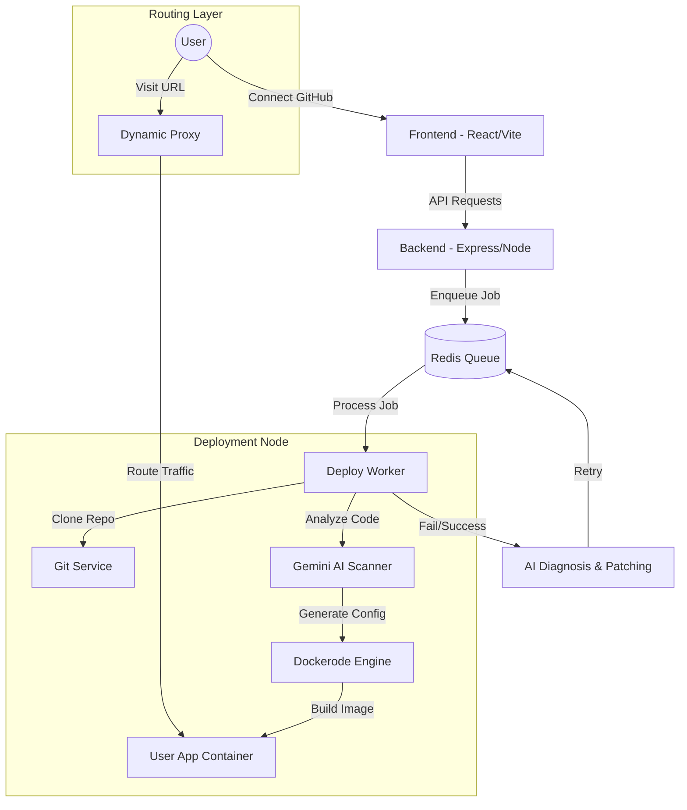

# 🚀 DeployX — One-Click AI Deployment Platform


**DeployX** is a revolutionary AI-powered Platform-as-a-Service (PaaS) that allows developers to deploy their full-stack applications directly from GitHub with zero configuration. It features an industry-first **AI Self-Healing Pipeline** that automatically detects, diagnoses, and patches deployment errors in real-time.

---

## ✨ Key Features

- ⚡ **One-Click Deploy**: Connect your GitHub repo and let DeployX handle the rest.
- 🧠 **AI Self-Healing**: Powered by **Gemini 2.0** and **Groq (Llama 3.3)** to auto-fix build errors.
- 📦 **Dynamic Containerization**: Automatically generates Dockerfiles and builds optimized images on-the-fly.
- 📡 **Real-time Log Streaming**: Watch your deployment progress live via WebSockets.
- 🔗 **Smart Proxy Routing**: Dynamic routing via `nip.io` with instant SSL-ready subdomains.
- 🛠️ **Monorepo Support**: Deploy specific sub-directories (Frontend/Backend) from a single repo.

---

## 🏗️ System Architecture

DeployX is built as a robust, distributed system composed of specialized micro-services:



---

## 📂 Component Breakdown

### 1. 🖥️ Frontend (React + Framer Motion)
A premium, dark-themed dashboard that visualizes the "Network Topology" of your deployments.
- **Hook-based state management**: Real-time updates via custom hooks.
- **Interactive Pipeline**: Visual step-by-step progress tracker.

### 2. ⚙️ Backend (Node.js + Express)
The brain of the operation, handling authentication, project metadata, and project orchestration.
- **RESTful API**: Secure endpoints for project management.
- **Socket.IO**: Bi-directional communication for live log streaming.

### 3. 👷 Worker Service (BullMQ)
The heavy lifter that handles the actual deployment lifecycle.
- **Framework Detection**: Identifies if your app is React, Next.js, Node, or Static.
- **Dockerode Integration**: Communicates with the Host Docker Socket to manage containers.

### 4. 🧠 AI Engine (Gemini & Groq)
The unique "Self-Healing" layer.
- **Log Analysis**: Scans build logs for `npm` errors, missing dependencies, or config issues.
- **Auto-Patching**: Writes code fixes directly to the temporary build context and retries the deployment.

### 5. 🛡️ Dynamic Proxy (Http-Proxy)
A custom-built routing engine that maps subdomains (e.g., `myapp-abc.100.x.x.nip.io`) to internal Docker containers dynamically.

---

## 🚀 Getting Started

### Prerequisites
- Node.js v18+
- Docker Engine installed and running
- Redis Server
- MongoDB

### Installation
1. Clone the repository:
   ```bash
   git clone https://github.com/samay-hash/shery_hackathon.git
   ```
2. Install dependencies for both folders:
   ```bash
   cd frontend && npm install
   cd ../backend && npm install
   ```
3. Set up your `.env` in the `backend` folder:
   ```env
   MONGODB_URI=your_mongo_uri
   GEMINI_API_KEY=your_gemini_key
   GROQ_API_KEY=your_groq_key
   GITHUB_CLIENT_ID=...
   GITHUB_CLIENT_SECRET=...
   ```
4. Start the engine:
   ```bash
   docker-compose up --build
   ```

---

## 🛡️ Hackathon Goals Reached
- [x] Full-stack containerization from root or sub-dir.
- [x] Real-time WebSocket log feedback.
- [x] AI-powered error diagnosis and fallback (Groq).
- [x] Dynamic proxy with nip.io support.

---

<p align="center">
  Built with ❤️ for the <b>Sherians Hackathon</b> by <a href="https://github.com/samay-hash">@samay-hash</a>
</p>